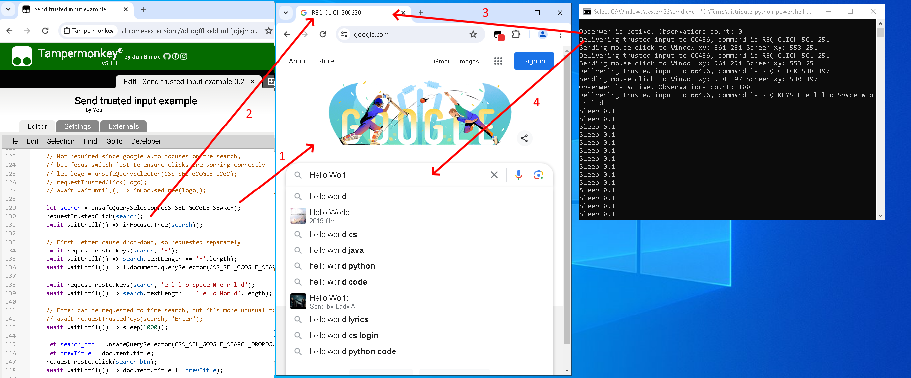

# Send trusted js events
This script is slightly polished old experiment on 
- bypassing userscript limitation to generate trusted events (with WinApi)
- automatisation of mouse input to background web pages 

Probably some framework will be much better choice nowadays, used workaround produced extra complications.

One of extra experiments were fluent simultaneous mouse events over multiple background web pages (pop-up windows).  
File `src/custom_script.py` suits well for such extensions outside of userscript limitations.

Included default scenario is trusted keyboard and mouse input to Google.com. Expected to work on Chrome and Firefox.
To run,  
1) Add `src/Test.user.js` to Tapermonkey browser extension
2) Open Google.com and via page right click (context) menu run Tapermonkey script
3) Run `src/main.py`, possibly via run.bat

If a Hello World request happens after brower goes background, script is working as expected.

Preview:

  

